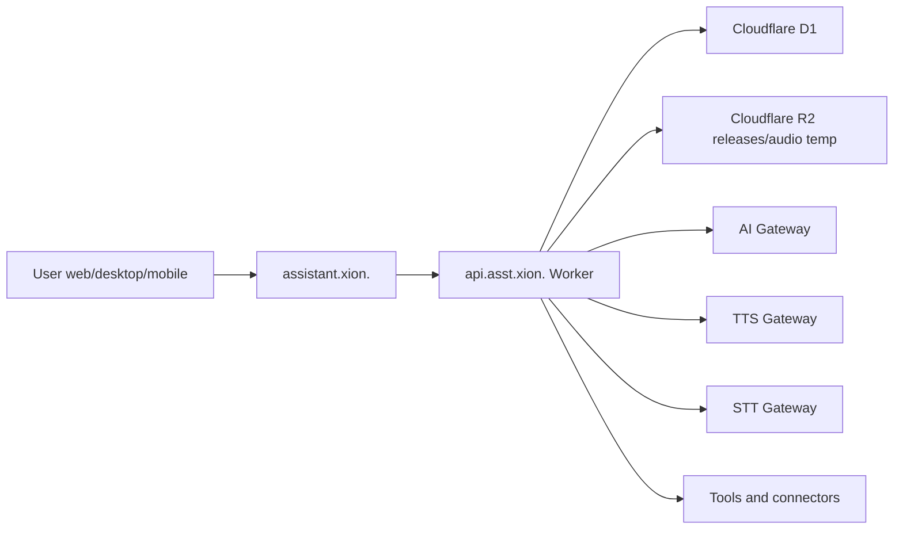

# Architecture

## Logical Diagram

## User Flow

User writes or speaks. Client sends request to Worker. Worker validates input, loads user memory/settings by `user_id`, creates plan/action if needed, asks confirmation for sensitive steps, then returns text and optional audio.

## Voice Flow

Client records only after user permission. No 24/7 backend audio. Worker exposes voices, voice settings, TTS mock, and STT placeholder. Real providers stay server-side.

## Memory Flow

Every memory row has `user_id`. Reads and writes must filter by `user_id`. Alias example: `mi esposa` -> `Camila` for user A never affects user B.

## Action Flow

Tools have risk level. High risk actions become `pending_confirmation`. Sending messages, deleting data, executing local commands, and publishing content never run without explicit confirmation.

## Update Flow

Apps query `/api/updates/latest`. Manifest includes version, platform, channel, URL, sha256, size, changelog, required flag and minimum supported version. Publishing requires real checksum.

## Multiuser Flow

Data ownership uses `user_id` on personal tables: memories, contacts, sessions, devices, voice, usage, actions, plans, reminders, connected apps.

## Web/API Separation

- Web: `assistant.xion.<TU_DOMINIO>`.
- API: `api.asst.xion.<TU_DOMINIO>`.
- Generic routes are avoided to prevent collision with other projects.
